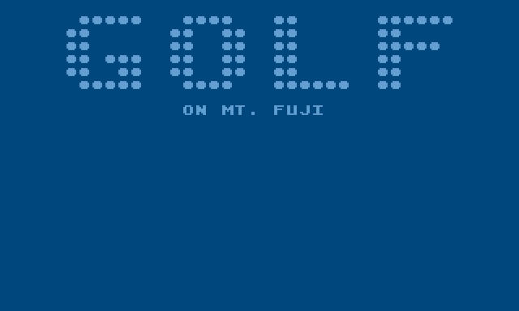

# Golf on Mt. Fuji

By Kim Slawson, February – March 2021

*NOMAM* 2021 10-Line BASIC competition entry (EXTREME-256 category)

Requires an Atari 8-bit machine or emulator running TurboBASIC XL (800XL minimum)

The provided disk image contains TurboBASIC XL and automatically runs the game.

## The pitch
18 holes of golf, but on Japan’s famous Mount Fuji.

## To play
Use the joystick to aim the cursor in the direction you want to hit the ball. The farther you aim, the harder you hit the ball. Hit the ball into the hole in as few strokes as possible.

## Please note
“Mount Fuji” is procedurally generated. Any similarity to actual mountains, living or dead, is purely coincidental.

## Colophon
Golf on Mount Fuji would not have been possible without standing on the shoulders of giants. I owe a large debt of gratitude to @dmsc for basicParser, @skr for MacTurban, and @mozzwald and @tschak909 for the wonderful FujiNet adapter (ALL HAIL THE FUJINET!) 

## Source code
Please find the commented source code in this repository (if you are curious). You may also wish to look at the obfuscated source code (if you are masochistic).

## Get in touch 

  ▪	[OxC0FFEE on AtariAge](https://atariage.com/forums/profile/50996-oxc0ffee/)
  ▪	[OxC0FFEE on Twitter](https://twitter.com/OxC0FFEE)
	▪	[kimslawson@gmail.com](mailto:kimslawson@gmail.com)
